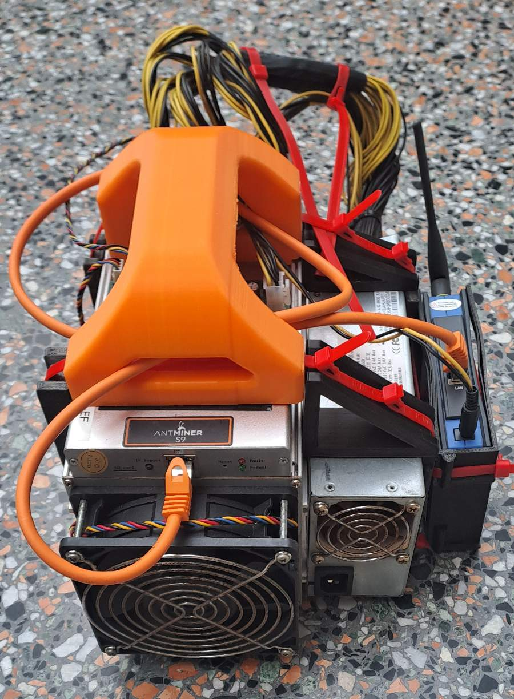
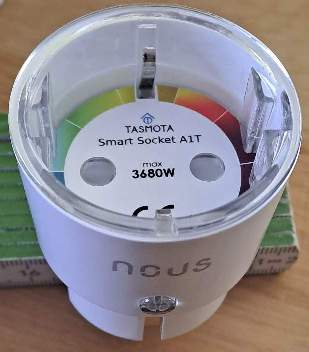
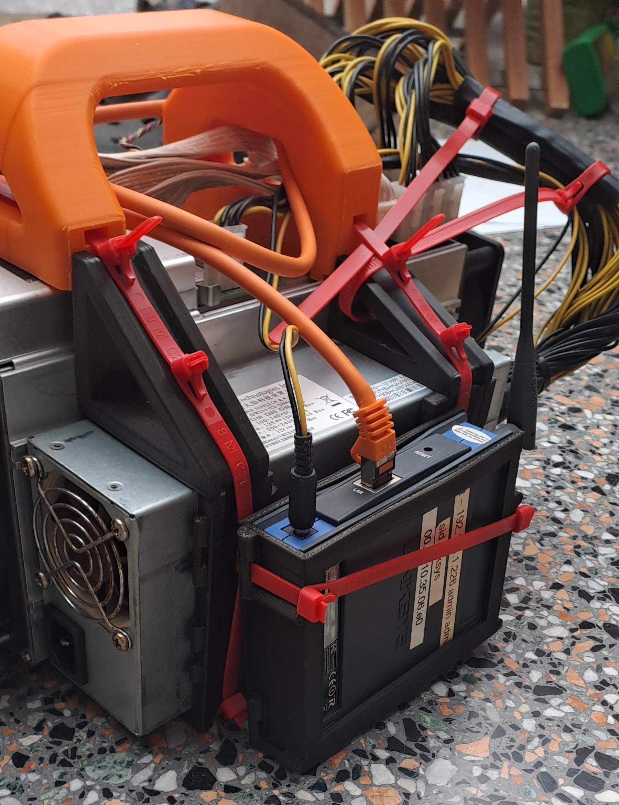
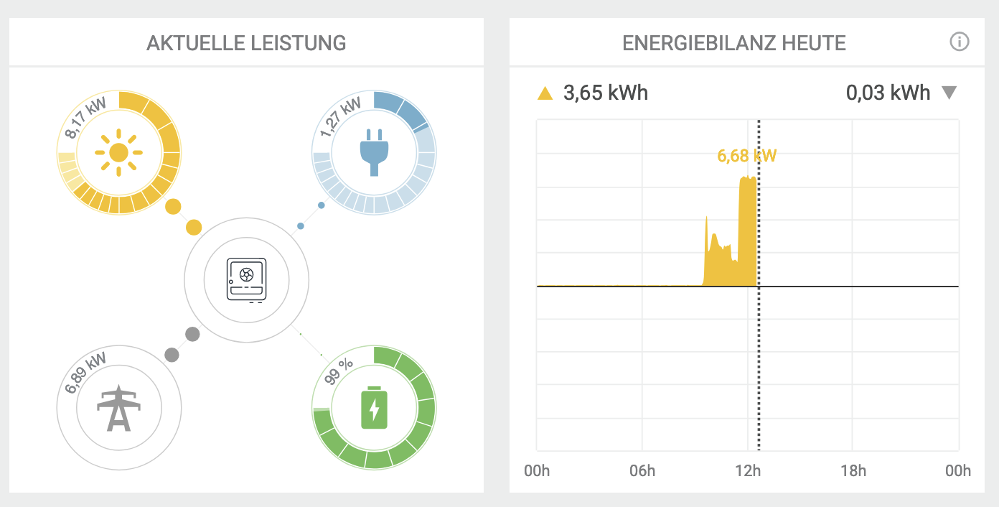

# Bitcoin Mining mit PV-Überschuss

 **oder: wie man mit einem Antminer S9 der Einspeise-Abregelung entgeht**

**Schlüsselwörter:** Photovoltaik, PV, Wechselrichter, Fronius, Kostal, Antminer S9, mining, BTC, Bitcoin, Braiins OS
**Keywords:** Photovoltaics, PV, inverter, Fronius, Kostal, Antminer S9, mining, BTC, Bitcoin, Braiins OS 


[TOC]


### Einführung
Neulich kam ein Kollege an, der sich eine neue PV-Anlage hat installieren lassen. Leider wird die Einspeisung ins Stromnetz bei seinem Stromversorger bei 7,0 KW abgeregelt, so dass er nicht mehr als die 7,0 KW einspeisen kann, während die Anlage 8,5 KW hat. (Vielleicht weil dort noch kein Smartmeter, sondern nur ein intelligenter Stromzähler installiert ist.) Egal, das Problem ist: Wenn der Wechselrichter abregelt, fängt er an, den überschüssigen Strom in Wärme umzusetzen, um sie so zu "verbrauchen". Die Frage war, ob man den überschüssigen Strom nicht noch für etwas "Sinnvolles" nutzen kann. Die Idee war, hierfür einen Bitcoin-Miner einzusetzen. Dieser setzt zwar auch nur Strom in Wärme um, jedoch mit einem gewissen Nutzwert. Die Grundidee ist, dass ein Steuerungs-Skript regelmäßig den Wechselrichter abfragt und so das Mining an die Erzeugung der PV-Anlage koppelt.



### Material und Methoden
Die Wahl des Bitcoin-Miners fiel auf einen gebrauchten günstigen Antminer S9, der über einen Händler (21energy) bei eBay bezogen wurde. Bei den Antminern S9 handelt es sich um ausgemusterte Miningfarm-Exemplare, die nach einer Säuberung verkauft werden. Für heutiges profitables Mining sind diese Geräte nicht mehr kosteneffizient und überschwemmen gerade den Markt. Für um die 130 Euro bekommt man einen 14TH Miner mit einem maximalen Verbrauch von 1400 Watt. Der bzw. die Lüfter sind bei diesen Geräten meist verschlissen und müssen ersetzt werden. Der minimale Verbrauch eines Antminer S9 liegt bei 300 Watt, der maximale Verbrauch bei 1400 Watt. Um das Gerät komplett auszuschalten, wurde eine WLAN-Steckdose (mit offener Schnittstelle) bezogen. Die Wahl fiel auf Tasmoda NOUS WiFi Socket A1T; diese kann man zum Beispiel bei Amazon (ASIN: B0054PSIPA) erwerben. Da bei meinem Kollegen im Haus nur ein WLAN (ohne weitere Kabelanbindung) vorhanden ist, haben wir dem Miner noch eine Ethernet-Bridge spendiert. Er hatte schon eine VONETS VAP11G-300 (z.B. Amazon ASIN: B014J54D9U) besorgt. Diese kann über USB mit 5V betreiben werden oder über eine Buchse mit 12V. Getestet wurde mit einem Downstepper (12V auf 5V) und dem USB-Anschluss. Diese Bridge ist brauchbar, verteilte aber beim Booten auch mal temporäre IP-Nummern. Ich hatte noch eine Linksys WET54G, welche sich als die bessere der beiden Varianten für unseren Zweck herausstellte. Man könnte auch das Nachfolgemodell von Linksys, WET610N, verwenden. Mit einem Kabel und einem Netzgerät-Hohlstecker (Ø innen: 2,5 mm, Ø außen: 5,5 mm, 14 mm Schaftlänge) kann die Bridge WET54G direkt am Netzteil des Miners angeschlossen werden. Ethernet-Bridges setzen nur ein physikalisches Medium auf ein anderes um - hier WLAN auf Kabel. Wenn die Möglichkeit besteht, den Miner per LAN mit dem Router zu verbinden, kann diese Komponente entfallen. Ich habe einen Kostal-Wechselrichter, und der Kollege hat einen Fronius-Wechselrichter. Daher haben wir mit beiden Wechselrichtern getestet. Um das Gerät gut transportieren zu können, habe ich ihm einen schönen Griff zum Tragen spendiert [AntminerGriff]. Den Griff habe ich modifiziert, und für die Linksys-Bridge habe ich eine zusätzliche Halterung entworfen. Eine Modifikation der Lüfterauslässe beim Antminer habe ich nicht vorgenommen. Für die Steuerungs-Skripte wurde ein kleiner Linux-PC, der schon vorhanden war, verwendet. Auch ein Raspberry Pi oder kleiner Fujitsu FUTRO S940 tun hier hervorragende Dienste. 
Der Anschluss und die Inbetriebnahme der einzelnen Komponenten stellt eine gewisse Herausforderung an das Netzwerk- und Router-Konfigurationswissen dar, da der Linux-Rechner auf diese drei Komponenten per TCP/IP zugreifen muss. Wenn alle Komponenten im selben WLAN sind, ist es einfach. Wenn man am Router virtuelle Hosts und Port-Forwarding einstellen muss, bedarf es gewisser Kenntnisse. Hilfreich zum Einrichten ist ein IP-Scanner wie der freie Advanst IP-Scanner [AIPS].


#### Inbetriebnahme 
##### Tasmoda WiFi Socket 
Die WLAN-Steckdose in eine Steckdose einstecken und mit dem Smartphone nach neuen WLANs suchen. Solange die WLAN-Steckdosen nicht konfiguriert sind, bauen sie einen Hotspot auf. Mit diesem verbindet man sich per Web-Browser: http://192.168.4.1/ (die IP 192.168.4.1 ist fest als Hotspot vorgegeben). Nun geht man unter ‚Einstellungen‘ und bindet diese Steckdose in das eigene WLAN ein. Die nun vom Router zugewiesene IP im eigenen Heimnetzwerk sucht man sich unter DHCP-Clients am Router heraus und setzt eine Reservierung auf dieses Gerät aufgrund der MAC-Adresse der WiFi-Steckdose. Einen Factory-Reset der WLAN-Steckdose kann man bei Bedarf durch über 40 Sekunden langes Halten des Einschaltknopfes vornehmen.



##### Antminer S9 mit Braiins OS 
Damit der Antminer S9 seine Leistung dynamisch regulieren kann, muss man die letzte verfügbare Version von Braiins OS (v 22.08.1) installieren. Der Antminer S9 wird nicht von der aktuellen Version von Braiins OS unterstützt, was aber auch im vorliegenden Fall nicht schadet. Das neueste Image ist braiins-os_am1-s9_sd_2022-09-27-0-26ba61b9-22.08.1-plus.img und unter [LBOS] herunterzuladen. Dieses Image schreibt man mit Rufus [Rufus] auf eine MicroSD Karte. Nun muss man das Controllerboard des Antminers ausbauen, da man leider nicht anders an die Jumper kommt (alle Kabel abstöpseln, Schrauben lösen, Controller-Board herausziehen). Hier gibt es vier Jumper nebeneinander, die wie folgt gesetzt sein sollten: Boot from NAND = 0100. Den Jumper 4 setzen wir nun auf 1, damit von der SD-Karte gebootet wird. Also stecken wir den Jumper wie folgt auf 0101. Nun alles wieder zusammenbauen und überprüfen, dass die Platine wirklich richtig in der Führung ist und nirgends auf dem Gehäuse aufsetzt (Kurzschlussgefahr). Jetzt SD-Karte einstecken, einschalten und der Miner bootet von der SD-Karte. Hinweis: Die rote LED (Fault) leuchtet immer am Anfang, bis das Gerät einen stabilen Systemzustand erreicht hat. Nach dem Booten die IP des Gerätes ermitteln (IP-Scanner oder am Router nachsehen) und sich per SSH mit dem Gerät verbinden. Auch hier sollte man im Router eine Reservierung der IP im DHCP-Server vornehmen. Der Login erfolgt über root und kein Kennwort. Nun kommt die ganze Magie: mit `miner nand_install use_factory_cfg` wird die letzte Version von der SD-Karte in den Speicher übertragen. Gerät danach ausschalten, wieder das Controller-Board ausbauen, den Jumper S4 auf 0 zurücksetzen (= 0100) und Board wieder einbauen und verkabeln. Eine Schritt-für-Schritt-Anleitung dieses Vorgangs gibt es unter [HroNetz]. (Hinweis: Die auf dieser Seite empfohlene ROM-Version ist nicht die letzte.) Nach einem Start (der erste Bootvorgang dauert etwas länger) kann man nun per Web-Browser auf die Oberfläche des Miners zugreifen `http://<Miner-ip>/` und das Feintuning übernehmen oder etwas herumspielen.

##### Linksys WET54G Ethernet-Bridge
Am besten vor der Konfiguration einen Reset des Gerätes durchführen (Taster auf der Rückseite). Dann baut die Bridge einen Hotspot auf, mit dem man sich verbinden kann, oder man verwendet den Kabel-Anschluss. Die Default-IP ist 192.168.1.226, und folglich konfiguriert man die Bridge mit http://192.168.1.226/. Das erste Login erfolgt mit admin / admin. Nun sucht man auch hier das Heim-WLAN und bucht sich ein. Das Gerät darf keinen eigenen DHCP-Server verwenden. Die Bridge übernimmt die IP und MAC-Adresse vom Client (hier der Antminer). Es ist durchaus normal, dass man mehrere Versuche braucht, bis man eine Ethernet-Bridge konfiguriert hat und diese reibungslos läuft.




##### Linux-Rechner
Linux installieren und einen CronJob für den AntminerJob eintragen.

#### Netzwerkübersicht


```
Möglichkeit 1 (hier beschrieben):
--> [Router] <---> LAN
        ^
        |
        +------> WLAN <---> Linux-PC, Wechselrichter, Antminer mit WLAN-Bridge, WLAN-Steckdose
        

Möglichkeit 2:
--> [Router] <---> LAN > Linux-PC, Wechselrichter, Antminer mit Kabel
        ^
        |
        +------> WLAN > WLAN-Steckdose

```

#### Skripte
**TasmodaSteckdose.sh**: Dieses Bash-Skript fragt den Zustand der WiFi-Steckdose ab und schaltet den entsprechenden Zustand (also ein oder aus). Eigentlich ist es nur ein 'intelligentes' Togglen. Wenn der Zustand 'an' ist und an-geschaltet werden soll, macht das Skript nichts.

**AntminerS9_SetPower.sh**: Das Skript fragt über die API-Schnittstelle die aktuellen Leistungsparameter ab und setzt über die Weboberfläche den Energiewert (neu).

**runme.sh**: Dieses Skript fragt den Wechselrichter ab, bestimmt den PV-Ertrag, schaltet ab einem festen Erzeugungsschwellenwert den Antminer über die WLAN-Steckdose ein und setzt im Folgenden die Leistungswerte bis maximal 1300 Watt, so dass der Wert der Einspeise-Kappung durch den dynamischen Hausverbrauch nicht erreicht wird. Fällt der Wert unter die Grenze wird der Antminer über die WLAN-Steckdose ausgeschaltet. Achtung, das Skript hat eine Zeitschranke, dass es nicht öfter als alle 5 Minuten aufgerufen werden kann. Dies soll verhindern, dass durch einen Fehler im Skript der Miner zu oft durch ein verändertes Powermanagement neu gestartet wird. Mit der Option `--dry`  umgeht man die Zeitschranke und auch das Setzen der Leitungseinstellung. Diese Option ist speziell für die ersten Aufrufe und das Testen gedacht. 

#### Konfiguration von runme.sh
```
Beispiel zu Möglichkeit 1 von Netzwerkübersicht (Fritzbox auf 192.168.178.1 - alles in einem Netzwerk)
INVERTER_IP=192.168.178.101     (Wechselrichter IP)
ANTMINERS9_IP=192.168.178.110   (Antminer IP)
WIFIPLUG_IP=192.168.178.112     (WLAN-Steckdose IP)
INVERTER="./inverter/FroniusSymoGEN24.sh --host $INVERTER_IP"

Beispiel zu Möglichkeit 2 von Netzwerkübersicht (TP-Link Router auf 192.168.1.1 - zwei verschiedene Netzwerk-Bereiche)
INVERTER_IP=192.168.1.150
ANTMINERS9_IP=192.168.1.149 
WIFIPLUG_IP=192.168.1.1:8101   # Port-Weiterleitung auf virtuellen Server am Router (von 8101 -> auf 192.168.2.101 Port 80 (WLAN-Bereich = 192.168.2.x) 
INVERTER="./inverter/Kostal.sh --host $INVERTER_IP"

Abriegelung in Watt:
PV_POWERCUT=6600

Miner-Werte (minimal und maximal) in Watt:
MINER_MIN=300
MINER_MAX=1300

Leistungsschritte in Watt:
PDEL=200

Diesen Wert sollte man nicht (!) verändern, da dieser eine Sicherheitsbegrenzung darstellt:
MINER_POWERLIMIT=1400

```

Eine Port-Weiterleitung auf Port 80 zu Geräten ist je nach Routermodell etwas kniffliger, da der Port 80 in der Regel schon vom Router für seine eigene Weboberfläche verwendet wird. Moderne Router können jedoch einen Quell-Port und Ziel-Port definieren. 


**Theoretische Weiterleitungen**:
- Antminer: Port 80 und 4028
- Tasmoda WLAN-Steckdose: Port 80
- Wechselrichter: Port 80 (http) oder 502 oder 1502 (modbus)


#### Datenübergabe Wechselrichter
Die Datenübergabe vom Wechselrichter-Skript an das Ablaufskript erfolgt über folgende Parameter in 'strout' als ganzzahlige Werte (Integer) - (nicht als Float oder Double):
```
##+PV## -> PV-Wert in Watt als ganzzahliger Wert
##+HOME## -> Hausverbrauchs-Wert in Watt als ganzzahliger Wert 
##+GRID## ->  Einspeise-Wert in Watt als ganzzahliger Wert (Strombezug ist negativ)
##-BATTERYCHARGE## -> Batterieladung (negativer Wert = Batterie wird geladen, positiver Wert = Batterie wird entladen)
##+BATTERYCARGEPERCENT## -> Ladezustand der Batterie in Prozent (z.B. 55% Charge) 
```

#### Algorithmus
Derzeit ist der Algorithmus sehr einfach gehalten: Wenn der PV-Ertrag größer als 6300 Watt ist, dann schalte den Antminer mit 300 Watt ein und setze die Leistung in 200W-Schritten hoch oder runter, so dass die Kappung möglichst nicht erreicht wird. Da aus den Wechselrichter-Skripten auch andere Werte übergeben werden, könnten noch andere Nebenbedingungen herangezogen werden. Für unsere Zwecke war der Schwellenwert der PV-Erzeugung ausreichend. 

## Ergebnis
Die Skripte funktionieren, und eine Abregelung seitens des Energieversorgers wurde nach der Inbetriebnahme des Miners nicht mehr erreicht. Die Einschaltgrenze ist derzeit in der Testphase noch niedrig angesetzt (der Herbst lässt grüßen).




## Diskussion
Es gibt vergleichbare Lösungen mit Home Assistant oder ioBroker. Ziel war eine schlichte unabhängige Lösung zu finden. Es hat Spaß gemacht, das Projekt zu entwickeln. Ob es sich langfristig rechnet, ist eine andere Sache. Bei der Anschaffung muss man bedenken, dass man die ca. 150 Euro Investition auch wieder herausbekommen sollte. Zu beachten ist auch, dass die aktuellen Miner wie der Avalon Nano 3S für ganze 6 TH nur 140 Watt verbrauchen. Diese modernen Geräte kosten jedoch auch in der Anschaffung mehr, sind schwerer zu beziehen und sind für dieses Projekt daher eher zweitrangig. Hier ging es ja darum, ein Kilowatt mit einer günstigen Lösung vor der Abregelung (Kappung) zu "retten". Außerdem wird dadurch der Lüfter des Wechselrichters entlastet, der ansonsten die dort anfallende Wärme abführen müsste. Zu beachten ist, dass ein Antminer S9 ebenfalls wie der Wechselrichter die Energie von 1300 Watt in Wärme umsetzt und bei voller Last nicht ganz leise ist. Der Vorteil dieser Lösung ist jedoch, dass die Wärme gezielt an einem anderen Ort als dem des Wechselrichters erzeugt und entweder dort genutzt oder evtl. nach außen abgeleitet werden kann. Bei jeder Leistungsanpassung startet der Antminer S9 durch und beide Lüfter gehen für kurze Zeit auf 100 % Leistung, was dem Sound einer Heulboje gleichkommt. Vermutlich kann man dies im Braiins OS irgendwo abstellen bzw. einstellen. Uns hat es bisher nicht gestört, da das Gerät im Keller steht oder nur kurz auf dem Küchentisch getestet wurde. Mit dem Gerät kann man sowohl 'Bitcoin' als auch 'Bitcoin Cash' minen. Ob man mit dem Miner Solomining (Lotterie-Mining) betreibt oder ein paar Zehntelcent pro Sonnenstunde durch einen normalen Mining-Pool wie f2pool einnimmt, ist jedem selbst überlassen.

## Credits
Dieses Projekt wäre nicht ohne andere Personen und ihre Entwicklungen möglich gewesen. Hierzu zählen die beiden Abfrageskripte zu den Wechselrichtern von Fronius und Kostal, sowie die stl-Dateien zum 3D-Druck der praktischen Tragevorrichtung des Antminers S9:
- **Fronius Python-Skript: Andreas Kleber** https://github.com/akleber/fronius-json-tools/
- **Kostal Python-Skript:  Kilian Knoll** https://github.com/carichte/kostal-modbusquery
- **3D Dateien: @Nicolas & Schlimmer** [AntminerGriff]
- **Anleitung zum Flashen von Braiins OS: Ralf Bösenberg** [HroNetz]


## Links

- **[AIPS]** Advanst IP-Scanner https://www.advanced-ip-scanner.com/de/
- **[Rufus]** https://rufus.ie/de/
- **[HroNetz]** https://hro-netz.de/upgrade-auf-die-letzte-fuer-den-antminer-s9-verfuegbare-braiins-version-2022-09-27-0-26ba61b9-22-08-1-plus-fuer-power_target-parameter-fuer-home-assistant-auf-antminer-s9-nand-setup-problemloesung/
- **[LBOS]** braiins os https://feeds.braiins-os.com/22.08.1/braiins-os_am1-s9_sd_2022-09-27-0-26ba61b9-22.08.1-plus.img
- **[AntminerGriff]** S9 Antminer Handle (Bitcoin Miner)von @Nicolas_b58 (Remix) https://www.printables.com/model/694007-s9-antminer-handle-bitcoin-miner
Original https://www.thingiverse.com/thing:5771853 von Schlimmer

## Release 
Oktober 2025
